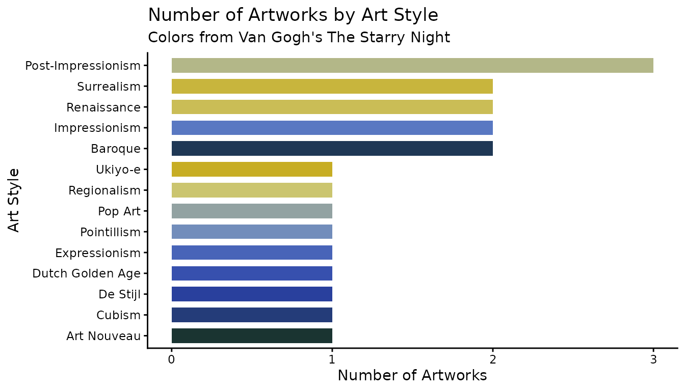
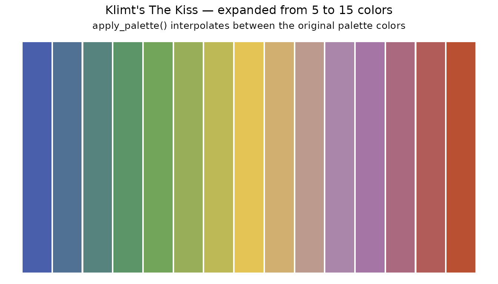

# Introduction to aRtpalette package

The `aRtpalette` package provides convenience functions for some common
tasks. To install this package from GitHub, use

``` r

# Option 1: using devtools
# install.packages("devtools")
devtools::install_github("ADC-405-S26/aRtpalette")

# Option 2: using pak
# install.packages("pak")
pak::pak("ADC-405-S26/aRtpalette")
```

Load the package using the following code.

``` r

library(aRtpalette)
library(ggplot2)
```

## Motivation

As a person who loves and is interested in art, I often find myself
struggling to bring the colors of artwork paintings into my data
visualizations in R. The process was frustrating, requiring manual
look-up of hex codes, copying them one by one, and then figuring out how
to apply them to a ggplot2 chart. There was no clean way to store a
palette as a table, visualize it before using it, or expand it when I
needed more colors than the original artwork provided.

The frustration motivated me to build `aRtpalette`. The goal for the
package was to bring to the user a small toolkit that makes working with
art-inspired Color palettes in R feel natural and streamlined. I wanted
to be able to store colors as a structured object, plot them as swatches
to preview what I was working with, and then expand a palette
creatively, when a chart needed more colors than the original painting
contained.

This vignette walks you through the three core functions of the package
and shows how they work together in a realistic workflow using the
built-in `artwork_palettes` dataset.

## The built-in dataset: `artwork_palettes`

This is a built-in dataset with a table of 20 palettes extracted from
iconic artworks across art history, sourced from [Color
Lisa](https://colorlisa.com). Each row is one artwork, and each palette
contains five hex color codes alongside metadata like the artist name
and art movement.

``` r

data(artwork_palettes)
head(artwork_palettes)
#>        palette_name                        artwork   artist    hex1    hex2
#> 1      starry_night               The Starry Night Van Gogh #1a3431 #2b41a7
#> 2     bedroom_arles               Bedroom in Arles Van Gogh #374D8D #93A0CB
#> 3 self_portrait_hat Self-Portrait with a Straw Hat Van Gogh #FBDC30 #A7A651
#> 4        great_wave    The Great Wave off Kanagawa  Hokusai #1F284C #2D4472
#> 5      water_lilies            Water Lilies (1906)    Monet #9F4640 #4885A4
#> 6     woman_parasol           Woman with a Parasol    Monet #82A4BC #4C7899
#>      hex3    hex4    hex5              style
#> 1 #6283c8 #ccc776 #c7ad24 Post-Impressionism
#> 2 #82A866 #C4B743 #A35029 Post-Impressionism
#> 3 #E0BA7A #9BA7B0 #5A5F80 Post-Impressionism
#> 4 #6E6352 #D9CCAC #ECE2C6            Ukiyo-e
#> 5 #395A92 #7EA860 #B985BA      Impressionism
#> 6 #2F5136 #B1B94C #E5DCBE      Impressionism
```

This is the kind of structured color table I always wanted to have
available in R. You can filter it by style, browse by artist, or pull
any row and immediately start working with the colors.

``` r

# How many art styles are represented?
table(artwork_palettes$style)
#> 
#>        Art Nouveau            Baroque             Cubism           De Stijl 
#>                  1                  2                  1                  1 
#>   Dutch Golden Age      Expressionism      Impressionism        Pointillism 
#>                  1                  1                  2                  1 
#>            Pop Art Post-Impressionism        Regionalism        Renaissance 
#>                  1                  3                  1                  2 
#>         Surrealism            Ukiyo-e 
#>                  2                  1
```

## Step 1: Creating a palette object with `palette_from_hex()`

The first function, palette_from_hex(), takes a vector of hex color
codes and a name, and returns a validated palette object of class
“artpalette”. The function checks that every hex code is properly
formatted before proceeding, so you get a clear error message instead of
a silent failure later in your workflow.

Let’s use Van Gogh’s Starry Night from the dataset and create a palette
object from it.

``` r

row <- artwork_palettes[artwork_palettes$palette_name == "starry_night", ]

starry_night <- palette_from_hex(
  hex_codes = c(row$hex1, row$hex2, row$hex3, row$hex4, row$hex5),
  name      = "starry_night"
)

starry_night
#> $name
#> [1] "starry_night"
#> 
#> $colors
#> [1] "#1a3431" "#2b41a7" "#6283c8" "#ccc776" "#c7ad24"
#> 
#> attr(,"class")
#> [1] "artpalette"
```

The result is a list with the class “artpalette” that stores the name
and color codes. This object is what the other two functions expect as
input. The output is the central unit of the package. The function will
catch bad input immediately:

``` r

# This fails gracefully with a clear message
palette_from_hex(c("not_a_hex", "#FF5733"), name = "bad_palette")
#> Error in `palette_from_hex()`:
#> ! Invalid hex codes:not_a_hex
```

## Step 2: Visualizing a palette with `plot_palette()`

Before using a palette in a chart, it helps to see it. The second
function, plot_palette(), takes an `"artpalette"` object and renders a
clean color swatch grid showing each color block and its hex code. This
is the `store and preview` step that I always wished existed.

``` r

plot_palette(starry_night)
```


You can immediately see the deep navy blues and warm gold tones that
define the painting. This visual check before applying a palette to real
data is one of the most useful parts of the workflow. The function
removed the process of having to go back and forth, applying colors, not
liking them, and having to start over. Let’s also preview a few more
palettes from the dataset to compare styles:

``` r

# Monet's Water Lilies
row2 <- artwork_palettes[artwork_palettes$palette_name == "water_lilies", ]
water_lilies <- palette_from_hex(
  c(row2$hex1, row2$hex2, row2$hex3, row2$hex4, row2$hex5),
  name = "water_lilies"
)
plot_palette(water_lilies)
```


``` r

# Warhol's Marilyn Monroe
row3 <- artwork_palettes[artwork_palettes$palette_name == "marilyn_warhol", ]
marilyn <- palette_from_hex(
  c(row3$hex1, row3$hex2, row3$hex3, row3$hex4, row3$hex5),
  name = "marilyn_warhol"
)
plot_palette(marilyn)
```


Side by side, these three palettes already tell a story about how
different art movements use color. Impressionism leans toward softness
and naturalness, while Pop Art is bold and high-contrast.

## Step 3: Expanding a palette with `apply_palette()`

The third
function,[`apply_palette()`](https://adc-405-s26.github.io/aRtpalette/reference/apply_palette.md),
takes an `"artpalette"` object and a number n, and returns exactly n hex
color codes ready to use in a ggplot2 chart. If you ask for more colors
than the palette contains, the function interpolates between the
existing colors using R’s built-in color ramp. So the user can take a
5-color painting palette and expand it to 10, 15, or 20 colors for a
large categorical chart. This is what I mean by “expand on the original
palette for creativity.” The source painting gives you the anchor
colors, and the function handles the rest.

``` r

# Get exactly 3 colors from the Starry Night palette
three_colors <- apply_palette(starry_night, n = 3)
three_colors
#> [1] "#1A3431" "#6283C8" "#C7AD24"
```

``` r

# Expand to 10 colors — interpolating between the original 5
ten_colors <- apply_palette(starry_night, n = 10)
ten_colors
#>  [1] "#1A3431" "#213965" "#293F99" "#3D56B2" "#5574C0" "#7992B5" "#A8B091"
#>  [8] "#CBC46C" "#C9B848" "#C7AD24"
```

## A complete workflow

Here is a full example using `artwork_palettes` and all three functions
working together. We will count how many artworks belong to each art
style in our dataset and visualize it using the *Starry Night* palette.

``` r

# Step 1: Pull the Starry Night palette from our dataset
row_sn <- artwork_palettes[artwork_palettes$palette_name == "starry_night", ]

pal_sn <- palette_from_hex( hex_codes = c(row_sn$hex1, row_sn$hex2, row_sn$hex3, row_sn$hex4, row_sn$hex5),
  name = "starry_night"
)
# Step 2: Preview it before using it
plot_palette(pal_sn)
```


``` r

# Step 3: Count artworks per art style in artwork_palettes
style_counts <- as.data.frame(table(artwork_palettes$style))
colnames(style_counts) <- c("style", "count")

# Step 4: Expand the palette to match the number of style groups
chart_colors <- apply_palette(pal_sn, n = nrow(style_counts))

# Step 5: Build the chart using our own data
ggplot(style_counts, aes(x = reorder(style, count),
                          y = count,
                          fill = style)) +
  geom_bar(stat = "identity", width = 0.7) +
  scale_fill_manual(values = chart_colors) +
  coord_flip() +
  labs(
    title    = "Number of Artworks by Art Style",
    subtitle = "Colors from Van Gogh's The Starry Night",
    x        = "Art Style",
    y        = "Number of Artworks"
  ) +
  theme_classic() +
  theme(legend.position = "none")
```



This chart was built entirely from `artwork_palettes`. The style groups
came from the `style` column, the bar heights came from counting rows,
and the colors came from expanding the *Starry Night* palette using
[`apply_palette()`](https://adc-405-s26.github.io/aRtpalette/reference/apply_palette.md).
All three functions worked together in one clean pipeline.

## Creative expansion: going beyond the original palette

The
[`apply_palette()`](https://adc-405-s26.github.io/aRtpalette/reference/apply_palette.md)
function becomes useful when we need more colors than the original
painting provides. Here we take Klimt’s *The Kiss*, a 5-color palette,
and we will use the function to expand it to 15 colors, showing how the
function interpolates between the original colors while staying true to
the painting’s spirit.

``` r

# Start with Klimt's The Kiss (5 colors)
row_k <- artwork_palettes[artwork_palettes$palette_name == "kiss_klimt", ]
pal_k <- palette_from_hex(
  c(row_k$hex1, row_k$hex2, row_k$hex3, row_k$hex4, row_k$hex5),
  name = "kiss_klimt"
)
plot_palette(pal_k)
```


``` r

# Expand to 15 interpolated colors
expanded <- apply_palette(pal_k, n = 15)

expanded_df <- data.frame(
  x     = seq_len(15),
  color = expanded
)

ggplot(expanded_df, aes(x = x, y = 1, fill = color)) +
  geom_tile(width = 0.95, height = 0.8) +
  scale_fill_identity() +
  labs(
    title    = "Klimt's The Kiss — expanded from 5 to 15 colors",
    subtitle = "apply_palette() interpolates between the original palette colors"
  ) +
  theme_void() +
  theme(plot.title    = element_text(hjust = 0.5, size = 12),
        plot.subtitle = element_text(hjust = 0.5, size = 10))
```


This is what “expanding on the original palette for creativity” looks
like in practice: the source painting gives you the anchor colors, and
[`apply_palette()`](https://adc-405-s26.github.io/aRtpalette/reference/apply_palette.md)
handles the rest.

## Summary

The three functions in `aRtpalette` are designed to work as a pipeline:

1.  **[`palette_from_hex()`](https://adc-405-s26.github.io/aRtpalette/reference/palette_from_hex.md)**
    — store hex codes from any artwork as a validated, named palette
    object

2.  **[`plot_palette()`](https://adc-405-s26.github.io/aRtpalette/reference/plot_palette.md)**
    — preview the palette as color swatches before applying it to a
    chart

3.  **[`apply_palette()`](https://adc-405-s26.github.io/aRtpalette/reference/apply_palette.md)**
    — extract or expand the palette to exactly the number of colors your
    chart needs.
