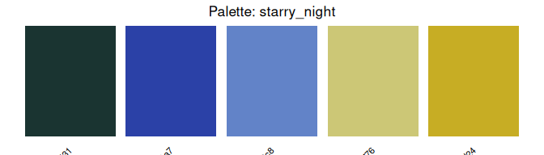
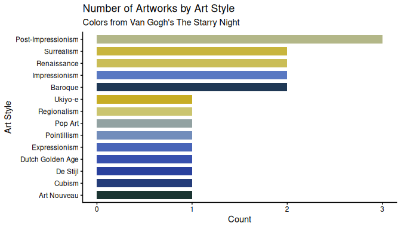

# aRtpalette

The goal of `aRtpalette` is to make it easy to bring art-inspired color
palettes into R-based data visualizations. The package lets you store
palettes as structured objects, preview them as color swatches, and
expand them when a chart needs more colors than the source artwork
provides.

The inspiration for this package came from the frustration of having to
use the colors from paintings in my ggplot2 charts, but there was no
clean workflow for doing so in R. As I used R, I had to manually copy
hex codes and hope the colors looked right once applied. I wanted a tool
that treated color as data, something you could store in a table,
validate, visualize, and manipulate programmatically.

## Installation

You can install the development version of `artpalette` from
[GitHub](https://github.com/) with:

``` r

# Option 1: using devtools
# install.packages("devtools")
devtools::install_github("ADC-405-S26/aRtpalette")

# Option 2: using pak
# install.packages("pak")
pak::pak("ADC-405-S26/aRtpalette")
```

## The built-in dataset

The package includes `artwork_palettes`, a table of 20 color palettes
extracted from iconic artworks across art history. Each row is one
painting, with five hex color codes and metadata including the artist,
artwork title, and art movement.

``` r

library(aRtpalette)
library(ggplot2)
data(artwork_palettes)
head(artwork_palettes[, c("palette_name", "artist", "style", "hex1", "hex2", "hex3")])
#>        palette_name   artist              style    hex1    hex2    hex3
#> 1      starry_night Van Gogh Post-Impressionism #1a3431 #2b41a7 #6283c8
#> 2     bedroom_arles Van Gogh Post-Impressionism #374D8D #93A0CB #82A866
#> 3 self_portrait_hat Van Gogh Post-Impressionism #FBDC30 #A7A651 #E0BA7A
#> 4        great_wave  Hokusai            Ukiyo-e #1F284C #2D4472 #6E6352
#> 5      water_lilies    Monet      Impressionism #9F4640 #4885A4 #395A92
#> 6     woman_parasol    Monet      Impressionism #82A4BC #4C7899 #2F5136
```

## Core functions

### `palette_from_hex()` — store colors as a validated object

``` r

row <- artwork_palettes[artwork_palettes$palette_name == "starry_night", ]

starry_night <- palette_from_hex(
  hex_codes = c(row$hex1, row$hex2, row$hex3, row$hex4, row$hex5),
  name      = "starry_night"
)

starry_night
#> $name
#> [1] "starry_night"
#> 
#> $colors
#> [1] "#1a3431" "#2b41a7" "#6283c8" "#ccc776" "#c7ad24"
#> 
#> attr(,"class")
#> [1] "artpalette"
```

The function validates every hex code on input and returns a clear error
message if any is malformed. So problems surface immediately rather than
silently breaking a chart later.

### `plot_palette()` — preview before you apply

``` r

plot_palette(starry_night)
```


Seeing the palette as swatches before applying it to real data saves the
back-and-forth of guessing whether the colors will work together.

### `apply_palette()` — expand for any chart size

``` r

# Exactly 3 colors for a 3-group chart
apply_palette(starry_night, n = 3)
#> [1] "#1A3431" "#6283C8" "#C7AD24"
```

``` r

# Expand to 8 colors via interpolation
apply_palette(starry_night, n = 8)
#> [1] "#1A3431" "#233B74" "#324AAB" "#5270BE" "#8096B0" "#BCBD81" "#C9BB52"
#> [8] "#C7AD24"
```

If you ask for more colors than the palette contains, the function
interpolates between the existing colors, allowing you to take the
original color and expand it creatively for any chart size.

## A full workflow example

Here we pull a palette directly from `artwork_palettes`, preview it as
swatches, then apply it to a chart, showing all three functions working
together in one clean pipeline.

``` r

# Step 1 — pull the Starry Night row from our dataset
# and turn it into a validated palette object
row <- artwork_palettes[artwork_palettes$palette_name == "starry_night", ]

pal <- palette_from_hex(
  c(row$hex1, row$hex2, row$hex3, row$hex4, row$hex5),
  name = "starry_night"
)

# Step 2 — preview the palette before using it
# so we know exactly what colors we are working with
plot_palette(pal)
```



The swatch view lets us confirm the colors look right before committing
them to a chart. This will prevent wasting time going back and forth in
the later process.

``` r

# Step 3 — count artworks by art style from our own dataset
style_counts <- as.data.frame(table(artwork_palettes$style))
colnames(style_counts) <- c("style", "count")

# Step 4 — expand the palette to exactly the number of 
# style groups we need using apply_palette()
chart_colors <- apply_palette(pal, n = nrow(style_counts))

# Step 5 — plug the colors directly into ggplot2
ggplot(style_counts, aes(x = reorder(style, count),
                          y = count,
                          fill = style)) +
  geom_bar(stat = "identity", width = 0.7) +
  scale_fill_manual(values = chart_colors) +
  coord_flip() +
  labs(
    title    = "Number of Artworks by Art Style",
    subtitle = "Colors from Van Gogh's The Starry Night",
    x        = "Art Style",
    y        = "Count"
  ) +
  theme_classic() +
  theme(legend.position = "none")
```



The palette came from `artwork_palettes`, was previewed with
[`plot_palette()`](https://adc-405-s26.github.io/aRtpalette/reference/plot_palette.md),
expanded to fit the number of style groups with
[`apply_palette()`](https://adc-405-s26.github.io/aRtpalette/reference/apply_palette.md),
and applied directly to the chart. No hex codes were typed by hand.

## Summary

`aRtpalette` provides three functions that work together as a pipeline :

1.**[`palette_from_hex()`](https://adc-405-s26.github.io/aRtpalette/reference/palette_from_hex.md)**
— store hex codes from any artwork as a validated, named palette object

2.**[`plot_palette()`](https://adc-405-s26.github.io/aRtpalette/reference/plot_palette.md)**
— preview the palette as color swatches before applying it to a chart

3.**[`apply_palette()`](https://adc-405-s26.github.io/aRtpalette/reference/apply_palette.md)**
— extract or expand the palette to exactly the number of colors your
chart needs.

Combined with the built-in `artwork_palettes` dataset of 20 palettes
from iconic artworks, the package makes it easy to bring art history
into R without any manual hex code lookup.

## Learn more

See the full vignette for a detailed walkthrough including palette
comparison across art movements, the complete art analysis workflow, and
more ggplot2 examples:

``` r

vignette("getting-started-with-aRtpalette")
```
